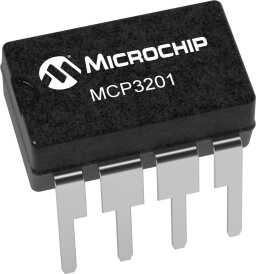

MCP3201 12-Bit A/D Converter
=======================================

.. seo::
    :description: Instructions for setting up the MCP3201 12-Bit Analog to Digital Converter in ESPHome.
    :keywords: MCP3201
    :image: mcp3201.jpg

The Microchip Technology Inc. MCP3201 is a single-channel successive
approximation 12-bit Analog-to-Digital (A/D) converter with on-board sample
and hold circuitry.

.. _mcp3201-component:

Component/Hub
-------------

The MCP3201 component allows you to use MCP3201 12-Bit A/D Converter
(`datasheet <https://ww1.microchip.com/downloads/aemDocuments/documents/APID/ProductDocuments/DataSheets/21290F.pdf>`__) in ESPHome.
The MCP3201 uses the :ref:`SPI Bus <spi>` for communication.

It reports voltage in relation to the ``reference_voltage`` (default is 3.3V).
It calculates the voltage by multiplying the ``reference_voltage * value`` on the pin (basically the percentage of VREF)

Most configurations will set the ``reference_voltage`` = VREF pin

.. code-block:: yaml

    # Example configuration entry
    mcp3201:
      cs_pin: GPIOXX
      reference_voltage: 3.3V

Configuration variables:
************************

- **cs_pin** (**Required**, :ref:`Pin Schema <config-pin_schema>`): The SPI cable select pin to use.
- **reference_voltage** (*Optional*, float): The reference voltage. Defaults to ``3.3V``.

Sensor
------

The ``mcp3201`` sensor allows you to use your MCP3201 12-Bit A/D Converter
sensor with ESPHome.  First, configure the `mcp3210` component and then
create a `sensor` using the `mcp3201` platform to report the voltage to
Home Assistant.

.. code-block:: yaml

    # Example config
    # This is a small 1.5v solar panel power rail attached to the MCP3201
    sensor:
      - platform: mcp3201
        id: solar_voltage
        update_interval: 30s

Configuration variables:
************************

- **update_interval** (*Optional*, :ref:`config-time`): The interval to check the sensor. Defaults to ``60s``.
- All other options from :ref:`Sensor <config-sensor>`.

See Also
--------

- :ref:`spi`
- :apiref:`mcp3201/mcp3201.h`
- :ghedit:`Edit`
